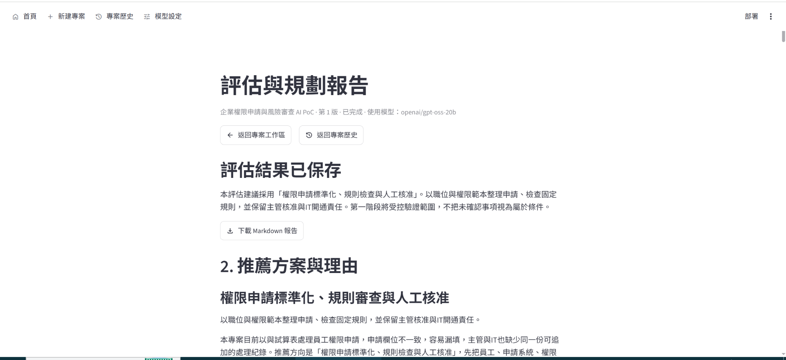
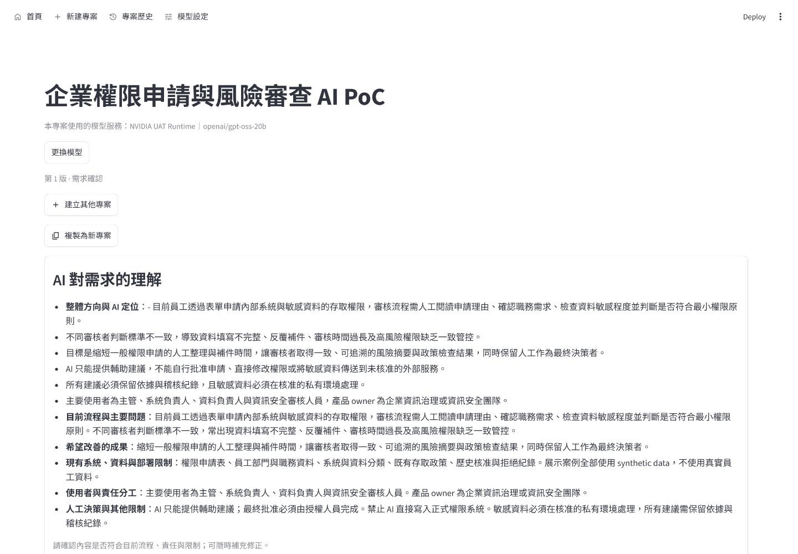
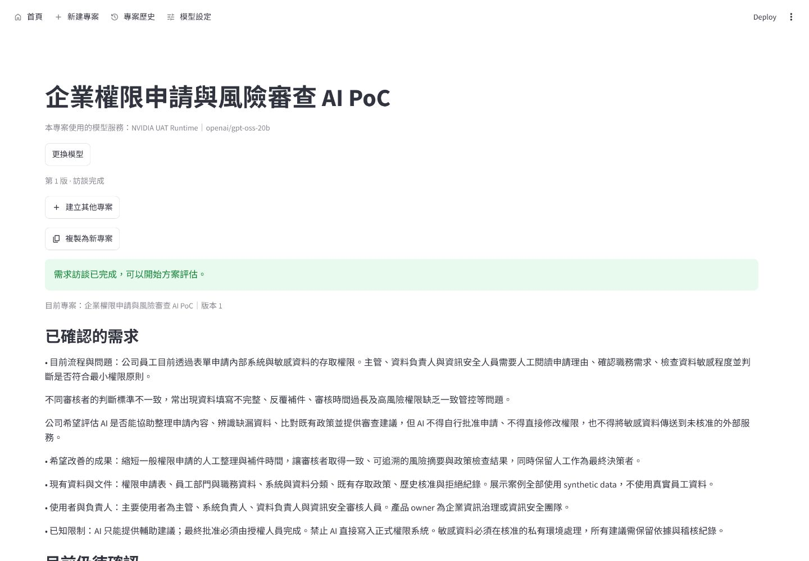
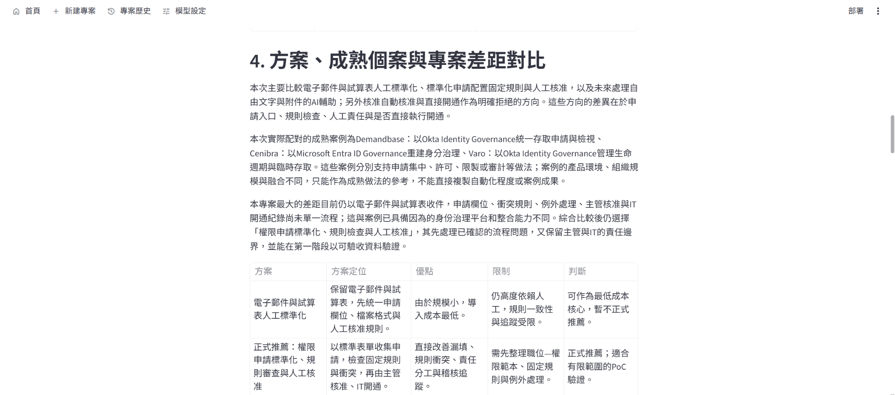
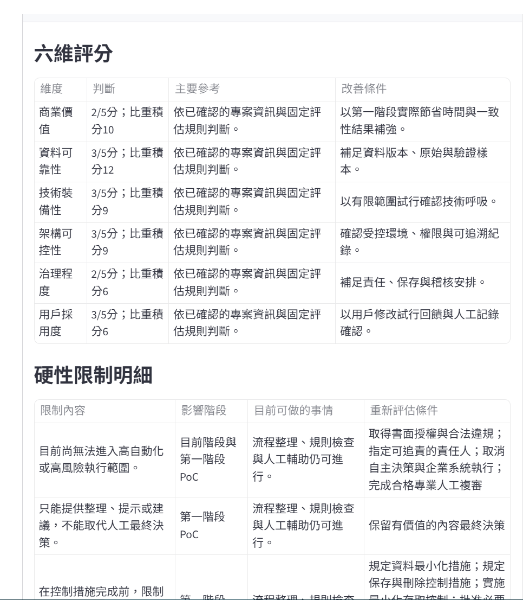
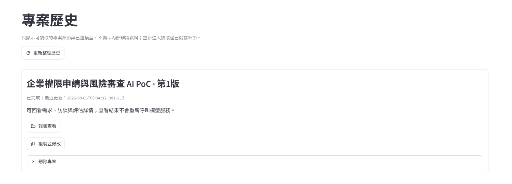

# AI PoC Planner

AI PoC Planner 是一個本機優先、連接真實 OpenAI-compatible provider 的企業 AI 導入需求分析與 PoC 規劃工具。它把模糊的企業需求整理成可確認的事實、可比較的方案、受治理約束的建議，以及可下載的 Markdown 規劃報告。

> 一句話定位：將模糊企業需求轉換為可追溯、具治理邊界的 AI PoC 評估與執行計畫。



模糊需求會先經過 AI 需求理解與有界訪談，再由程式完成正式的 matching、scoring、hard gates 與 recommendation。成果保存於 SQLite，完成版本可從專案歷史重新進入 Results，並下載已持久化的 Markdown 報告。

## 目前產品狀態

目前 `main` 已包含可操作的 FastAPI 與 Streamlit 產品流程，而不是規格草稿或 scripted demo。

- 每個專案綁定自己的 model profile，正式分析只能使用該專案已選定、啟用並完成 readiness 驗證的 profile。
- 所有真實模型呼叫共用一個 OpenAI-compatible provider adapter；P7.2a 已以 NVIDIA 與本機 llama.cpp 代表端點完成相容性 checkpoint。
- Discovery 已支援需求理解、修正、確認與最多三輪的針對性訪談。
- Assessment 已包含 deterministic opportunity matching、六維評分、recommendation category 與 hard gates。
- Results 已整合 reviewed-case matching、專案差距、可移植做法、分階段路線與 article-style report。
- SQLite 會保存 project、discovery、PlanningRun、assessment 與 report；完成後可從 history re-entry 回到 Results。
- Markdown 下載直接使用已保存報告；reload、history 與 download 不會重新呼叫 provider。
- P7.1 本機 UAT runtime 已完成，可用受監督的一鍵流程啟動與停止 FastAPI、Streamlit。
- fake provider 僅用於 deterministic automated tests，不是公開產品模式，也不存在 silent runtime fallback。

目前狀態：

- **P7.2a Representative dual-endpoint compatibility：Complete**
- **P7.2b Full golden-scenario compatibility matrix：Pending**
- **P7.2 overall：Incomplete**；四個 golden scenarios 的完整雙端點矩陣尚未宣告完成。
- **P8.1a Portfolio baseline：Complete**
- **P8.1b Product-owner and release acceptance：Complete**
- **P8.1b overall：Complete**；archive-backed history owner acceptance 已通過；consumer installer／release packaging 尚未完成。

P7.2a 的完成只代表 `governed_access` 代表情境通過雙端點驗證，不代表所有情境或所有模型／runtime 都已認證。

## 這個工具適合誰？

- 企業業務負責人：把模糊的 AI 導入構想整理成可討論、可審查的 PoC 方案。
- PoC／轉型負責人：透過 bounded Discovery、confirmed facts 與方案比較，準備下一步決策。
- 技術面試官與工程團隊：檢視真實 provider 整合、結構化輸出、持久化與 deterministic governance 邊界。
- 作品集讀者：用一個可啟動的本機產品流程理解 AI 與程式規則如何協作。

AI 的價值在於理解模糊需求、提出有脈絡的訪談問題，以及產生受 schema 約束的候選敘事；正式推薦、分數、hard gates、權限邊界與案例事實仍由程式驗證與決定。

## 作品集展示

本作品集使用 canonical synthetic `governed_access` Demo：企業想評估 AI 是否能協助整理員工權限申請、檢查固定規則與缺漏，並提供風險摘要。主要使用者是主管、系統負責人、資料負責人與資訊安全審核人員；產品 owner 是企業資訊治理或資訊安全團隊。

AI 可以理解需求、提出有限追問、整理候選敘事與報告內容；AI 不得自行批准申請、直接修改正式權限，或把敏感資料送到未核准的外部服務。正式推薦、六維評分、hard gates、reviewed cases 與一致性檢查由 deterministic code 負責。

展示流程：

```text
企業需求 → AI requirement understanding → bounded interview
→ deterministic assessment → hard gates → persisted report → history re-entry
```

核心價值：

- 將模糊企業需求整理成可確認、可追溯的 AI PoC 規劃。
- 讓 LLM 負責理解與敘事，讓 deterministic code 負責正式推薦、評分與治理限制。
- 支援 project/version 持久化、History re-entry、Markdown download 與 Windows quickstart。

主要技術：Python、FastAPI、Streamlit、LangChain、Pydantic、SQLite，以及 OpenAI-compatible structured output。

### 畫面導覽

下列圖片均來自真實產品 UI；公開 reviewed cases 名稱可作為來源脈絡保留，canonical demo 本身仍使用 synthetic data。

<table>
<tr>
<td valign="top">
<a href="docs/portfolio/assets/02-requirement-understanding.png"></a>
<p><strong>需求理解。</strong>產品把原始企業問題整理成流程、目標、資料、使用者與治理邊界。</p>
</td>
<td valign="top">
<a href="docs/portfolio/assets/03-bounded-interview.png"></a>
<p><strong>有界訪談。</strong>使用者逐輪確認必要資訊，完成後才進入方案評估。</p>
</td>
</tr>
<tr>
<td valign="top">
<a href="docs/portfolio/assets/04-assessment-comparison.png"></a>
<p><strong>方案比較。</strong>Results 同時呈現方案定位、限制、成熟案例與正式判斷。</p>
</td>
<td valign="top">
<a href="docs/portfolio/assets/05-hard-gates-and-cases.png"></a>
<p><strong>治理檢查。</strong>六維評分與 hard gates 將 human final decision、私有處理與可追溯條件放在正式結果中。</p>
</td>
</tr>
<tr>
<td valign="top" colspan="2">
<a href="docs/portfolio/assets/06-history-and-report.png"></a>
<p><strong>History re-entry。</strong>完成版本可直接重新開啟，產品使用已保存的結果，不重新呼叫 provider；Markdown report 也可從 Results 下載。</p>
</td>
</tr>
</table>

### 作品集文件

- [AI PoC Planner Case Study](docs/portfolio/CASE_STUDY.md)
- [AI PoC Planner Interview Notes](docs/portfolio/INTERVIEW_NOTES.md)
- [P8.1 portfolio baseline](docs/portfolio/P8_1_PORTFOLIO_BASELINE.md)

### 作品集範圍與限制

- P7.2a：Complete；P7.2b：Pending；P7.2 overall：Incomplete。
- P8.1：Complete；P8.2a Windows portfolio quickstart：Complete；consumer installer 尚未完成。
- API key 目前保存在 private local model profile，並非 production-grade credential storage。
- 本專案沒有 cloud deployment、multi-provider business logic 或 PDF／DOCX export。
- 這個作品集展示套件是文件與資產整理，不是新的產品 roadmap phase。

## 產品流程

```text
建立專案並綁定 model profile
→ 輸入最小需求
→ AI 理解、使用者修正與確認
→ 最多三輪針對性訪談
→ confirmed facts
→ reviewed-case matching 與方案分析
→ deterministic scoring、recommendation category、hard gates
→ article-style Results 與持久化 Markdown report
→ history re-entry／download
```

## 決策邊界

LLM 只負責：

- 理解模糊需求；
- 提出結構化訪談問題；
- 產生受 schema 約束的候選方案與敘事內容。

程式碼負責：

- opportunity 與 reviewed-case matching；
- recommendation category；
- 六維評分與加權總分；
- hard gates；
- 正式建議、案例、分數與報告的一致性。

Provider 輸出不能覆寫 deterministic decision logic，也不能自行宣告正式 recommendation、score 或 gate disposition。

## Provider 與 model profile

每個專案保存自己的安全 model-profile snapshot。正式流程要求 profile 與目前已測試的真實連線一致；缺少、停用、未測試或不一致時會 fail closed，而不是改用 fake provider 或其他模型。

目前只有一個 OpenAI-compatible adapter。它是 NVIDIA 雲端基線與本機 llama.cpp 代表端點的共同邊界，不代表產品具有多 provider business logic 或多套專用 adapter。

Profile 目前由「模型設定」頁面建立、編輯、測試與選擇；產品沒有 profile import／export UI。private local `model_profiles.json` 是 runtime state，不是應提交或放入作品集的範例檔。

### Provider capability contract

每個 profile 必須明確宣告 transport capability，不以 provider 或 model 名稱猜測：

| Capability | Supported values |
| --- | --- |
| Transport | OpenAI-compatible `/v1/chat/completions` |
| Authentication | `none`、`bearer_optional`、`bearer_required` |
| Token parameter | `max_tokens`、`max_completion_tokens` |
| Reasoning parameter | `unsupported`、`reasoning_effort` |
| Structured output | `json_schema`、`json_object` |

只會依 profile capability 使用 `Authorization: Bearer <token>`；不支援 `x-api-key`、query-string key、Basic、OAuth exchange、AWS-style signing 或其他非本產品 contract 的 authentication。這是明確的 compatibility scope，不是「支援所有 OpenAI-compatible endpoint」的宣稱。

作品集可用兩種非敏感代表設定說明範圍：remote Bearer endpoint 使用文件用 `example.invalid` base URL 與 `bearer_required`；local no-auth endpoint 使用 `http://127.0.0.1:8080/v1` 與 `none`。兩者都必須由使用者明確選擇 model name 與其他 capability，文件不放 real key。

## 持久化與安全

- SQLite 保存專案、版本、可見對話、confirmed facts、PlanningRun、assessment 與 report。
- 完成版本維持不可變；後續修改建立新的版本。
- 不保存 system prompt、chain of thought、LangChain tool trajectory、raw provider response、Authorization header 或 API key 到 project SQLite、public API、logs、UI 或 Markdown report。
- MVP 仍會將 API key 以明文保存於本機 private `model_profiles.json`，以支援已選 profile 的 provider 呼叫；這不是 production-grade credential storage，也不等同於加密保存。若要部署到真實企業環境，後續應改用 Windows Credential Manager、OS keychain 或其他受控 secret store。
- 錯誤回應不得洩漏 secrets、raw response、內部路徑或技術診斷。
- 高影響人事、醫療、法律、信用或財務情境保持 assistive-only，人工保留最終決定。

## 本機執行

P7.1 提供專案自有的 Windows 本機 runtime，使用安全埠範圍：

- Streamlit UI：`18501-18599`
- FastAPI：`18610-18699`
- 不使用 `8000` 作為產品預設埠

從專案目錄啟動 UAT：

```powershell
.\scripts\start-local.ps1 -Mode Uat
```

查詢狀態與停止：

```powershell
.\scripts\status-local.ps1 -Mode Uat
.\scripts\stop-local.ps1 -Mode Uat
```

Runtime 只負責驗證專案 `.venv`、選擇安全埠、啟動／監督 FastAPI 與 Streamlit、開啟瀏覽器及可靠停止。它不會安裝 provider、下載模型或建立雲端帳號。

## Windows portfolio quickstart（P8.2a）

這是作品集用的 Windows quickstart，不是正式 consumer installer。從 GitHub 下載並解壓縮專案 ZIP 後：

1. 第一次雙擊「安裝 AI PoC Planner.cmd」。
2. 雙擊「啟動 AI PoC Planner.cmd」。
3. 使用期間保持啟動視窗開啟。
4. 完成後在啟動視窗按 Ctrl+C 安全停止。

安裝入口會保持視窗可見，顯示成功或失敗結果後等待使用者確認；啟動入口只在啟動失敗時暫停，成功時讓瀏覽器開啟產品。若入口無法執行，也可在專案根目錄使用 PowerShell troubleshooting／進階方式：

```powershell
powershell.exe -NoProfile -ExecutionPolicy Bypass -File .\setup.ps1
```

`setup.ps1` 會：

1. 檢查可用的 Python 3.12；找不到時顯示 Python for Windows 的安裝指引，不會自動安裝系統 Python；
2. 只在專案目錄建立 `.venv`，已存在且版本相容時直接重用，不會每次刪除或重建；
3. 使用 `.venv` 內的 Python 執行 `pip install -e .`，只安裝產品 runtime dependencies；
4. 安裝失敗時保留現有 `.venv`，顯示可依 pip 輸出與網路／寫入權限檢查的錯誤指引。

完成後可直接雙擊根目錄入口：

| 入口 | 用途 |
| --- | --- |
| `安裝 AI PoC Planner.cmd` | 委託 `setup.ps1` 建立／重用 `.venv` 並安裝 runtime dependencies |
| `啟動 AI PoC Planner.cmd` | 以 UAT 模式啟動既有 FastAPI／Streamlit runtime 並開啟瀏覽器 |


兩個入口只是委託 `setup.ps1` 或既有 `scripts/start-local.ps1`，不建立第二套 process、port 或 state 管理。啟動視窗會保持開啟，完成後可在該視窗按 Ctrl+C 安全停止。可從包含空格或非 ASCII 字元的專案路徑執行，不需要系統管理員權限，也不會寫入全域 PATH、修改系統 Python、安裝 CUDA／GPU driver／Docker、provider、模型或讀取／輸出 API key。

若專案內已有但不是 Python 3.12 建立的 `.venv`，setup 會停止並要求使用者自行處理該環境，不會覆蓋它。Python 3.12 是本 quickstart 的唯一系統前置條件；模型、provider 與真實 profile 仍由使用者依產品流程明確設定。

PowerShell troubleshooting／進階方式：

```powershell
py -3.12 -m venv .venv
.\.venv\Scripts\python.exe -m pip install -e ".[dev]"
.\scripts\start-local.ps1 -Mode Uat
```

啟動後依序操作：

1. 在「模型設定」建立一個 OpenAI-compatible model profile；目前 UI 不提供 profile import。
2. 填入 endpoint、模型名稱與 capability；API key 只保存在本機 profile，不會顯示在公開回應或報告。
3. 執行 readiness test；未測試通過的 profile 不可進入正式分析。
4. 建立專案，使用下方的 synthetic `governed_access` Demo 完成需求理解、訪談、Assessment 與 Results。
5. 從「專案歷史」重新進入結果，或下載已持久化的 Markdown report。

沒有可用且已測試的 provider 時，產品會 fail closed；不會偷偷切換 fake provider。Runtime 也不會啟動 llama.cpp、安裝 provider、下載模型或建立雲端帳號。

## `governed_access` portfolio Demo

Demo 直接重用 [`tests/fixtures/product_acceptance/scenarios.json`](tests/fixtures/product_acceptance/scenarios.json) 的 `scenario_id=governed_access`。這是作品集用的 synthetic fixture，不是真實公司的員工或權限資料。

展示路徑：

`模型設定 → readiness test → 新建專案 → 需求理解與修正 → 確認 → bounded interview → Assessment → Results → Markdown download → 專案歷史／reload`

展示重點是：主管保留最終核准、AI 不直接寫入權限、未核准的外部個資不送出，以及 deterministic recommendation、reviewed cases 與 hard gates 不會被 provider 內容覆寫。

不要在作品集截圖或報告中放入 API key、Authorization、provider raw response、prompt、reasoning、事實 token、SQLite 路徑或暫存 evidence 路徑。

## 驗證基線

PR #24 已合併至 `main`，完成 P6.7 Results narrative、reviewed-case catalog consistency 與 report persistence 的產品驗收基線。PR #26 已完成 P7.2a `governed_access` 雙端點 compatibility checkpoint；P7.2b 四情境矩陣仍待後續驗證。NVIDIA OpenAI-compatible provider 已完成真實 Discovery、Assessment、Report 與 browser UAT；fake provider 仍只支援離線且可重現的自動測試。

## 明確不包含

目前不包含：

- 多 Agent 或 LangGraph；
- FAISS 或向量資料庫；
- Docker；
- 自動安裝 llama.cpp、Ollama、LM Studio、vLLM 或模型檔；
- provider 專用 adapter 或多 provider business logic；
- 雲端部署、帳號建立、多租戶；
- PDF／DOCX 匯出。

## 開發驗證

```powershell
python -m pytest
python -m ruff check .
python -m ruff format --check .
```

真實 provider UAT 必須明確 opt-in，且不得成為預設 CI 的秘密資料依賴。

## 文件

- [產品規格](docs/spec/SPEC.md)
- [實施計畫](docs/spec/PLAN.md)
- [任務拆分](docs/spec/TASKS.md)
- [專案記錄](PROJECT_LOG.md)
- [P8.1 portfolio baseline](docs/portfolio/P8_1_PORTFOLIO_BASELINE.md)

## License

MIT License. See [LICENSE](LICENSE).
