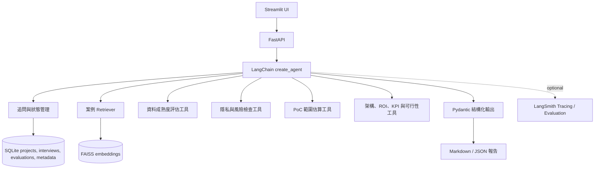

# AI 導入需求分析與 PoC 規劃 Agent 研究報告

## 執行摘要

「AI 導入需求分析與 PoC 規劃 Agent（AI Adoption Planner / AI PoC Planner）」最適合被定位為一個**單一 Agent、工具導向、以需求澄清與風險控管為核心**的企業導入規劃系統，而不是單純聊天機器人，也不是直接幫企業「自動做決策」的黑盒子。Microsoft 的 AI agent adoption 指南指出，Agent 適合多步驟決策、多工具／多系統協作與需要依情境調整流程的任務；若只是固定知識問答，經典 RAG（檢索增強生成）或一般程式通常更合適。已確認的相似專案中，Make.com AI Adoption Planner 側重企業成熟度與旅程記錄，AWS AI-PLC 側重產品探索與原型化流程，GAIK 側重從策略到實作的分層工具包。本專案若要具備公開作品集價值，最佳切法是：**以 FastAPI + LangChain 建立單一 Agent，整合案例 Retriever（檢索器）、資料成熟度評估、隱私與治理風險檢查、PoC 範圍估算、架構建議與結構化輸出，最後產出一份可儲存、可追蹤、可測試的 PoC 規劃書**；MVP（最小可行產品）不追求多 Agent 或過度基礎設施，而先把追問邏輯、工具觸發、風險 hard gate（硬性閘門）、Schema（資料結構規格）與可觀測性做紮實。[Microsoft：Business plan for AI agents][ms-agent-plan] [LangChain Agents][lc-agents] [Make AI Adoption Planner][make-planner] [AWS AI-PLC][aws-aiplc] [GAIK Toolkit][gaik]

## 目標與範圍

本專案最適合服務的使用者，不是最終一般員工，而是**需要把模糊業務需求轉成可實作 AI 工作方案**的中介型角色，例如 AI 軟體工程師、Solution Engineer（解決方案工程師）、Solution Architect（解決方案架構師）、AI 顧問、內部數位轉型 PM（產品經理）或技術 PM。這樣的定位，與 Microsoft 的 AI adoption planning 方法一致：先確認商業價值、使用者痛點、資料與治理條件，再做聚焦 PoC，而不是先選模型或堆技術。[Microsoft：Plan for AI adoption][ms-ai-plan]

從方法論上，本專案也應明確設下邊界：如果需求只是「固定文件查詢、FAQ、靜態知識摘要」，優先使用經典 RAG；如果流程完全固定且規則清楚，優先使用傳統程式或非生成式 AI；只有在任務需要多步驟決策、工具呼叫、跨系統協作，以及針對不完整輸入進行追問與動態規劃時，才值得進入 Agent 設計。這個邊界會直接影響 prompt（提示詞）、tool calling（工具呼叫）策略、測試方式與風險管理。[Microsoft：When to use AI agents][ms-agent-plan] [LangChain Retrieval][lc-retrieval]

### 建議的 MVP 範圍

MVP 應維持「一個 Agent + 一個案例知識庫 + 四到六個工具 + 一個固定輸出 Schema」的設計。LangChain 現行 `create_agent` 可組合模型、工具、system prompt、中介層與 `response_format`，適合本專案目標。[LangChain Agents][lc-agents] [LangChain Structured Output][lc-structured]

| 面向 | MVP 建議內容 | 備註 |
|---|---|---|
| 輸入欄位 | 產業、部門、欲改善流程、現有資料型態、預期成果、資料限制、預算等級 | **MVP 必要**；避免一次蒐集過多欄位，將缺口交給 Agent 追問 |
| 追問機制 | 最多 3–5 個高資訊增益問題 | **MVP 必要**；高於此數量會明顯拉長互動並降低完成率 |
| 工具 | 案例檢索、資料成熟度評估、風險檢查、PoC 範圍估算 | **MVP 必要** |
| 額外工具 | 架構建議、可行性分數計算 | **建議納入**；會讓輸出更接近顧問交付物 |
| 輸出 | `AI 導入初步評估報告` + 結構化 JSON / Pydantic | **MVP 必要** |
| 儲存 | SQLite | **MVP 必要**；PostgreSQL 僅列 Roadmap |
| 向量庫 | FAISS | **MVP 必要**；其他向量資料庫僅列 Roadmap |
| 追蹤/評估 | LangSmith tracing + 基本資料集評估 | **加分項**，但非常值得做 |

這樣的切法與 Microsoft 的 AI Plan 指南相符：先盤點資料與技術條件，再對 use case（使用案例）做可行性與價值排序，最後用 PoC 驗證核心假設，而且應從風險較低、內部使用、範圍可控的案例開始。[Microsoft：Plan for AI adoption][ms-ai-plan]

### 未指定假設與決策建議

下表是本專案在需求尚未明說時的統一決策。替代方案只列為 Roadmap，不屬於 MVP。[LangChain Models][lc-models] [SQLite 官方說明][sqlite-about] [FAISS 官方 repository][faiss]

| 未指定項目 | 建議預設 | 可選方案 | 優點 | 主要缺點 |
|---|---|---|---|---|
| 模型介面 | OpenAI-compatible API（透過抽象層） | 其他 LangChain chat model provider、fake model | `init_chat_model` 支援 provider 設定與自訂 `base_url`；核心流程只依賴內部 `ChatModelProvider` 契約，不硬編碼模型名稱 | 不同供應商對 tools 與 structured output 的能力不同，啟動時必須 capability check（能力檢查） |
| 部署環境 | 本機 Docker Compose | Roadmap：單機 VM、私有雲或其他受控環境 | MVP 只驗證本機 API + UI + SQLite + FAISS | 雲端與 Kubernetes 不在 MVP |
| 資料敏感性 | 預設「中度敏感」 | 低敏、不可離開公司、高敏／受監管 | 迫使系統在風險檢查時明確要求人工審查與資料邊界 | 若未收集此欄位，架構建議不得進入「建議進行」 |
| 向量庫 | FAISS | Roadmap：pgvector、Qdrant 或雲端向量資料庫 | FAISS 是本機、單程序 MVP 的固定選擇，案例 metadata 仍存 SQLite | 不適合多人並行寫入與集中式維運 |
| 記憶／狀態 | LangChain state + SQLite 持久化 | Roadmap：其他資料庫型 checkpointer | Streamlit session 僅負責 UI 暫態；正式 conversation state 寫入 SQLite | 必須避免把瀏覽器 session 當成唯一資料來源 |

### 向量庫與模型選型建議

若目標是先完成可測試的作品集 MVP，統一選型如下：

| 面向 | MVP 首選 | 為什麼 |
|---|---|---|
| Chat model（聊天模型） | OpenAI-compatible API + provider adapter | 以環境變數提供 model name、base URL 與 API key；核心不依賴特定模型名稱。[LangChain Models][lc-models] |
| 測試替代 | deterministic fake model（確定性假模型） | dry-run 測試不連外、不消耗 API 額度，並可穩定驗證工具軌跡與 Schema。 |
| 關聯資料 | SQLite | 專案、訪談、conversation state、評估、報告與案例 metadata 的唯一 MVP 儲存。[SQLite 官方說明][sqlite-about] |
| 向量索引 | FAISS | 僅保存案例 embeddings 與向量 ID；透過 SQLite metadata 對應原始案例。[FAISS 官方 repository][faiss] |

## 現有相似專案比較

以下比較的重點不是「哪一個產品成熟度最高」，而是**哪些可由原始專案確認的設計模式可以借用**。本次只保留 Make、AWS AI-PLC 與 GAIK；原報告中的 `Executive-AI-Advisor`、`NexAI_Research` 與特定 `AIMM` repository 因無法可靠對應原始專案而移除。[Make AI Adoption Planner][make-planner] [AWS AI-PLC][aws-aiplc] [GAIK Toolkit][gaik]

| 專案 | 核心功能 | 技術棧 | 可借鑑要點 | 與本專案差異 | 主要來源 |
|---|---|---|---|---|---|
| Make.com AI Adoption Planner | 透過導引式對話診斷四階段 AI 成熟度，記錄角色、目標與持續旅程日誌，產出角色化行動計畫 | Claude Code plugin、技能檔、Markdown journey log、本機持久化 | 借用「成熟度分級 + 持續旅程紀錄 + 角色導向建議」 | 偏企業整體 adoption journey，不是針對單一流程做 PoC 規劃 | [原始 repository][make-planner] |
| AWS AI-PLC | 以自然語言工作流協助 PM／商務角色做痛點分析、使用案例排序、PR/FAQ、產品策略與 prototype spec | Markdown workflow、Claude Code／Kiro、`PROTOTYPE-*.md`、`audit.md` | 借用「痛點→排序→原型規格」的 artifact 化與稽核軌跡 | 偏產品探索與原型化，不是企業 AI 治理評估器 | [原始 repository][aws-aiplc] |
| GAIK Toolkit | 從策略、需求、商業流程、實作、評估到安全合規的分層 GenAI 工具包 | 官方文件、Python package、demo、layer-based architecture | 借用需求、評估與安全合規分層，以及 use case 模板化 | 範圍比本專案大；本專案維持單一 Agent 與固定輸出 | [官方文件][gaik] |

綜合來看，整合策略不是複製任何單一案例，而是**把 Make 的成熟度觀、AWS AI-PLC 的 artifact 流程與 GAIK 的分層方法**收斂成更小、更工程實作導向的作品：**企業需求澄清→風險判定→方案規劃→可測試交付物**。[Make AI Adoption Planner][make-planner] [AWS AI-PLC][aws-aiplc] [GAIK Toolkit][gaik]

## LangChain 實作細節

LangChain 現行 `create_agent` 可組合 model（模型）、tools（工具）、system prompt（系統提示詞）、middleware（中介層）與 `response_format`（回應格式）。Agent 建立在 LangGraph 上，可擴充持久化狀態與 human-in-the-loop（人機協作）；MVP 不直接暴露 LangGraph 概念給使用者，而以自訂 state schema 與 SQLite repository 保存可重現的 conversation state。[LangChain Agents][lc-agents]

### Agent 設計與 tool calling 決策邏輯

你的 Agent 應採取**先澄清、再檢索、再評估、最後給方案**的流程，而不是看見需求就直接推薦模型。LangChain 的 context engineering（上下文工程）指南將系統提示詞、訊息、工具、回應格式與狀態列為需要控制的主要上下文來源。[LangChain Context Engineering][lc-context]

建議的決策順序如下：

| 決策階段 | 判斷條件 | 應採取動作 |
|---|---|---|
| 缺資訊檢查 | 缺少流程、資料型態、資料限制、成功標準中的兩項以上 | 先問 3–5 個高價值追問 |
| 相似案例 grounding（有依據的對齊） | 使用者已提供基本流程脈絡 | 先叫用案例 Retriever，避免空想式建議 |
| 風險前置 | 出現招募、錄取、醫療、法務、信用、個資、資料不得外流等字樣 | 先叫用 `check_privacy_risk`，必要時降級為 assistive-only（僅輔助）方案 |
| 技術可行性 | 有明確資料與限制 | 再叫用 `assess_data_readiness` 與 `recommend_architecture` |
| 範圍與投資 | 已知資料與整合點 | 最後叫用 `estimate_poc_scope` 與 `calculate_feasibility_score` |
| 最終輸出 | 所有關鍵工具已回應 | 產生結構化 PoC 報告 |

這樣的順序符合 Microsoft 對 agent 用例的界定：真正需要 Agent 的場景包含多步驟決策、多工具或多系統協作，以及面對不完整輸入時的自適應行為。NIST AI RMF 與 ICO 招募自動化指引則支持在實質影響個人權益的場景中明確配置治理責任與 meaningful human involvement（有意義的人類介入）。[Microsoft：Business plan for AI agents][ms-agent-plan] [NIST AI RMF][nist-rmf] [ICO：Recruitment rewired][ico-recruitment]

下面這段系統提示詞示範的是**MVP 必要**版本，重點是讓模型遵循順序、限制追問數量、避免越過風險邊界。LangChain 支援以 `system_prompt` 提供基礎行為，也可用 middleware 做動態提示。[LangChain Agents][lc-agents] [LangChain Context Engineering][lc-context]

```python
SYSTEM_PROMPT = """
你是企業 AI 導入需求分析與 PoC 規劃助手。

你的任務不是直接推薦模型，而是：
1. 先釐清需求與限制。
2. 如關鍵資訊不足，只提出最多 5 個追問，優先問高影響問題。
3. 在提出技術建議前，先檢索相似案例。
4. 遇到以下情況，必須先做風險檢查：
   - 招募/錄取/績效/信用/醫療/法律判斷
   - 個資、敏感資料、資料不得離開公司
5. 對高風險情境，不可建議全自動最終決策；必須配置人工審核點。
6. 最終輸出必須遵守結構化 Schema。
7. 若資料成熟度不足，優先輸出「先補資料／先做流程數位化」而不是硬做 AI。
"""
```

### Retriever 與 RAG 設計

LangChain 對 retrieval（檢索）的說明指出，RAG 可將索引程序與執行期檢索分離，適合本專案的本機案例知識庫；MVP 以 FAISS 保存 embeddings，以 SQLite 保存案例 metadata 與可稽核原文。[LangChain Retrieval][lc-retrieval] [FAISS 官方 repository][faiss]

你的案例庫不建議做成龐大百科，而應做成**小而乾淨的模式庫**。每筆案例建議至少包含：

| 欄位 | 建議內容 |
|---|---|
| `title` | 例如：合約條款審查、客服分類、掃描文件搜尋 |
| `industry` | 金融、製造、政府、醫療、SaaS 等 |
| `problem` | 原始需求描述 |
| `data_inputs` | PDF、掃描件、客服對話、表單、資料庫 |
| `fit_conditions` | 適用條件 |
| `non_fit_conditions` | 不適用條件 |
| `recommended_pattern` | RAG、分類、摘要、OCR + RAG、規則 + 人審 |
| `risk_flags` | 個資、法遵、決策影響、供應商依賴 |
| `kpis` | SLA、召回率、人工節省率、審查時間縮減 |
| `human_review` | 必要人工介入點 |

這種設計對應到 GAIK 分層方法：知識不只被搜尋，也要支撐需求、評估與治理。[GAIK Toolkit][gaik]

下列索引程式碼是**規格示意**，不是本輪建立的正式應用程式碼。它示範如何把 Markdown 案例轉成 FAISS 索引，並以注入的 `Embeddings` 介面避免核心流程綁定單一供應商。[LangChain Retrieval][lc-retrieval]

```python
from pathlib import Path
from langchain_core.documents import Document
from langchain_text_splitters import RecursiveCharacterTextSplitter
from langchain_community.vectorstores import FAISS
from langchain_core.embeddings import Embeddings

def load_case_markdowns(case_dir: str) -> list[Document]:
    docs: list[Document] = []
    for fp in Path(case_dir).glob("*.md"):
        text = fp.read_text(encoding="utf-8")
        docs.append(
            Document(
                page_content=text,
                metadata={"source": fp.name, "type": "case_markdown"}
            )
        )
    return docs

def build_case_retriever(embeddings: Embeddings):
    all_docs = load_case_markdowns("./case_library")
    splitter = RecursiveCharacterTextSplitter(
        chunk_size=800,
        chunk_overlap=120,
    )
    chunks = splitter.split_documents(all_docs)
    vector_store = FAISS.from_documents(chunks, embeddings)
    return vector_store.as_retriever(search_kwargs={"k": 4})
```

若要讓檢索結果更像「案例建議」而不是原文片段，可再包一個 tool，將命中文件轉成摘要化 JSON；工具描述、輸入格式與輸出格式都應視為可測試契約。[LangChain Context Engineering][lc-context] [LangChain Agents：Tools][lc-agents]

```python
from langchain.tools import tool
import json

@tool
def retrieve_similar_cases(query: str) -> str:
    """檢索最相似的 AI 導入案例，回傳可直接用於規劃的摘要列表。"""
    docs = retriever.invoke(query)
    payload = []
    for d in docs:
        payload.append({
            "source": d.metadata.get("source"),
            "summary": d.page_content[:500]
        })
    return json.dumps(payload, ensure_ascii=False, indent=2)
```

### Structured output 與 Pydantic Schema

對這個專案來說，Structured output（結構化輸出）是核心。LangChain `create_agent` 可透過 `response_format` 回傳 `structured_response`；`ToolStrategy` 適用於支援 tool calling 的模型，而 `ProviderStrategy` 依賴供應商原生能力。為維持供應商可替換性，MVP 的 Single Source of Truth 是 Pydantic schema，預設採 `ToolStrategy(PocProposal)`，並在模型初始化時檢查 tool calling 能力。[LangChain Structured Output][lc-structured] [Pydantic Models][pydantic-models] [OpenAI Structured Outputs][openai-structured]

下列 Schema 屬於**MVP 必要**。它已足夠支撐網頁呈現、資料庫儲存、Markdown 匯出與自動化評估。

```python
from typing import Literal
from pydantic import BaseModel, Field

class ClarifyingQuestion(BaseModel):
    question: str = Field(description="高資訊增益的澄清問題")
    reason: str = Field(description="為何必須先問這題")

class ArchitectureOption(BaseModel):
    name: str
    summary: str
    deployment: Literal["local", "private-cloud", "on-prem"]
    components: list[str]

class PocProposal(BaseModel):
    recommendation: Literal["建議進行", "條件式建議", "暫不建議"]
    problem_statement: str
    target_users: list[str]
    current_workflow_summary: str
    ai_fit_steps: list[str]
    non_ai_steps: list[str]
    required_data: list[str]
    missing_information: list[str]
    clarifying_questions: list[ClarifyingQuestion]
    similar_cases: list[str]
    architecture_options: list[ArchitectureOption]
    integrations: list[str]
    risks: list[str]
    human_review_points: list[str]
    success_metrics: list[str]
    estimated_weeks: int
    estimated_team: list[str]
    feasibility_score: int = Field(ge=0, le=100)
    next_actions: list[str]
```

### 對話狀態管理策略

這個專案的狀態管理，建議分成三層：

| 層次 | 儲存內容 | 實作方式 | 是否 MVP 必要 |
|---|---|---|---|
| 短期狀態 | 當前 thread 的訊息、已知欄位、追問答案、暫存工具結果 | LangChain checkpointer + `thread_id` | 是 |
| 結構化狀態 | 行業、部門、資料限制、預算、風險旗標、命中案例 | `state_schema` | 是 |
| 長期狀態 | 歷史需求、常見限制、已完成報告、評估紀錄 | SQLite | 是 |

LangChain Agent state 可保存訊息與自訂欄位；本 MVP 將 LangChain 執行期狀態與 SQLite 持久化 repository 分開，避免只依賴記憶體或 Streamlit session。[LangChain Agents：Memory][lc-agents] [SQLite 官方說明][sqlite-about]

```python
from typing import NotRequired
from langchain.agents import AgentState

class PlannerState(AgentState):
    industry: NotRequired[str]
    department: NotRequired[str]
    process_name: NotRequired[str]
    current_data: NotRequired[str]
    expected_outcome: NotRequired[str]
    data_constraint: NotRequired[str]
    budget_level: NotRequired[str]
    risk_level: NotRequired[str]
    similar_case_ids: NotRequired[list[str]]
```

### 工具規格與範例

工具必須有清楚名稱、描述、參數與欄位語意，因為這些內容會進入模型上下文並影響工具選擇。[LangChain Agents：Tools][lc-agents] [LangChain Context Engineering][lc-context]

下表整理本專案最實用的六個工具。規則與計算工具保持 deterministic（確定性），Agent 只負責決定呼叫順序與組織說明，便於用 pytest 與軌跡評估驗證。[LangChain Agents：Tools][lc-agents] [LangSmith Evaluation][langsmith-eval]

| 工具 | 目的 | 輸入 | 輸出 | 範例輸入 | 範例輸出 | MVP 狀態 |
|---|---|---|---|---|---|---|
| `assess_data_readiness` | 判斷資料是否足以支撐 PoC | 資料型態、數位化程度、標註/欄位品質、可存取性 | `score`、缺口、建議補強項 | PDF、半數掃描、無欄位標註、可內網存取 | `score=58`, `gaps=["需 OCR", "需欄位切分"]` | 必要 |
| `check_privacy_risk` | 判斷資料外流與合規風險 | 流程、資料限制、是否涉及個資/高風險決策 | `risk_level`、原因、是否必須人工介入 | 履歷篩選，含個資，不可出公司 | `risk=high`, `human_review_required=true` | 必要 |
| `estimate_poc_scope` | 估算週數與人力 | 整合點、資料準備、評估需求、UI 需求 | `weeks`、角色配置、主要風險 | OCR + 2 個內部 API + KPI 面板 | `weeks=3`, `team=["AI工程師","後端0.5人"]` | 必要 |
| `recommend_architecture` | 產出候選技術架構 | 資料限制、檢索需求、整合需求、部署偏好 | 部署方案、元件清單、原因 | 文件審查、不可外流、需審核台 | 本地模型 + OCR + FastAPI + FAISS | 建議納入 |
| `calculate_feasibility_score` | 彙總整體可行性 | 各工具分數、風險旗標、商業價值 | 0–100 分與說明 | 資料 70、風險高、商業價值高 | `score=63`, `label="條件式建議"` | 建議納入 |

下面的程式碼是**規格示意**，用來定義「規則先行、模型後補」的工具契約；正式實作必須依 `docs/spec/` 與 TASKS 逐項建立。[LangChain Agents：Tools][lc-agents]

```python
from typing import Literal
from pydantic import BaseModel, Field
from langchain.tools import tool

class DataReadinessInput(BaseModel):
    current_data: str = Field(description="現有資料描述")
    volume_level: Literal["low", "medium", "high"]
    digitized: bool
    scanned_ratio: float = Field(ge=0, le=1)
    labeled: bool

@tool(args_schema=DataReadinessInput)
def assess_data_readiness(
    current_data: str,
    volume_level: str,
    digitized: bool,
    scanned_ratio: float,
    labeled: bool
) -> dict:
    """評估資料成熟度與 PoC 所需補強。"""
    score = 40
    gaps = []

    if digitized:
        score += 20
    else:
        gaps.append("資料未完全數位化")

    if volume_level == "high":
        score += 15
    elif volume_level == "medium":
        score += 10
    else:
        score += 5

    if scanned_ratio > 0.3:
        gaps.append("需加入 OCR 流程")
        score -= 10

    if labeled:
        score += 15
    else:
        gaps.append("缺少可直接驗證的標註或欄位規則")

    return {
        "score": max(0, min(score, 100)),
        "gaps": gaps,
        "recommended_actions": [
            "先做文件分類與 OCR 基線",
            "建立 30-50 筆驗證樣本",
        ] if gaps else ["可直接進行 2 週 PoC"]
    }

class PrivacyRiskInput(BaseModel):
    process_name: str
    data_constraint: str
    contains_personal_data: bool
    decision_impact: Literal["low", "medium", "high"]

@tool(args_schema=PrivacyRiskInput)
def check_privacy_risk(
    process_name: str,
    data_constraint: str,
    contains_personal_data: bool,
    decision_impact: str
) -> dict:
    """檢查隱私、合規與高風險決策風險。"""
    reasons = []
    risk = "low"
    human_review_required = False

    sensitive_keywords = ["錄取", "招募", "醫療", "信用", "法律", "合約審查"]
    if any(k in process_name for k in sensitive_keywords):
        reasons.append("流程涉及高風險或權益重大影響領域")
        risk = "high"
        human_review_required = True

    if contains_personal_data:
        reasons.append("涉及個人資料")
        risk = "medium" if risk == "low" else risk

    if "不能離開公司" in data_constraint or "不可外流" in data_constraint:
        reasons.append("資料不可離開公司")
        risk = "high"
        human_review_required = True

    if decision_impact == "high":
        reasons.append("此流程可能直接影響個人權益")
        risk = "high"
        human_review_required = True

    return {
        "risk_level": risk,
        "reasons": reasons,
        "human_review_required": human_review_required,
        "recommended_guardrails": [
            "保留人工最終決策",
            "建立審核與覆核紀錄",
            "限制敏感資料出境"
        ] if human_review_required else ["一般治理控管即可"]
    }

class PocScopeInput(BaseModel):
    num_integrations: int = Field(ge=0, le=10)
    requires_ocr: bool
    needs_human_review_ui: bool
    needs_eval_dataset: bool
    privacy_restriction: Literal["low", "medium", "high"]

@tool(args_schema=PocScopeInput)
def estimate_poc_scope(
    num_integrations: int,
    requires_ocr: bool,
    needs_human_review_ui: bool,
    needs_eval_dataset: bool,
    privacy_restriction: str
) -> dict:
    """估算 PoC 週數與人力需求。"""
    points = 2 + num_integrations
    if requires_ocr:
        points += 2
    if needs_human_review_ui:
        points += 1
    if needs_eval_dataset:
        points += 1
    if privacy_restriction == "high":
        points += 2

    weeks = max(2, min(8, (points + 1) // 2))
    team = ["AI 工程師 1 人"]
    if num_integrations >= 2:
        team.append("後端工程師 0.5 人")
    if privacy_restriction == "high":
        team.append("IT / 資安 / 法遵代表 0.25 人")
    if needs_eval_dataset:
        team.append("業務領域專家 0.25 人")

    return {"estimated_weeks": weeks, "team": team, "complexity_points": points}

@tool
def recommend_architecture(
    data_constraint: str,
    requires_retrieval: bool,
    requires_ocr: bool,
    num_integrations: int
) -> dict:
    """依限制產出候選技術架構。"""
    deployment = "on-prem" if ("不能離開公司" in data_constraint or "不可外流" in data_constraint) else "local"
    components = ["FastAPI", "LangChain Agent", "SQLite", "Markdown 報告輸出"]
    if requires_retrieval:
        components.append("FAISS 案例向量索引 + SQLite metadata")
    if requires_ocr:
        components.append("OCR 前處理")
    if num_integrations > 0:
        components.append(f"{num_integrations} 個內部 API 串接")
    if deployment == "on-prem":
        components.append("本地模型或私有模型端點")

    return {
        "deployment": deployment,
        "components": components,
        "summary": "依資料邊界與功能需求選擇單一 Agent 架構，保留人工審核台。"
    }

@tool
def calculate_feasibility_score(
    business_value: int,
    data_readiness: int,
    technical_fit: int,
    architecture_controllability: int,
    governance_readiness: int,
    user_adoption: int,
) -> dict:
    """依六個 1–5 分維度計算 0–100 加權分數；不處理 hard gates。"""
    values = {
        "business_value": (business_value, 25),
        "data_readiness": (data_readiness, 20),
        "technical_fit": (technical_fit, 15),
        "architecture_controllability": (architecture_controllability, 15),
        "governance_readiness": (governance_readiness, 15),
        "user_adoption": (user_adoption, 10),
    }
    if any(not 1 <= value <= 5 for value, _ in values.values()):
        raise ValueError("每個評分維度都必須介於 1 到 5")

    score = round(sum((value / 5) * weight for value, weight in values.values()))
    label = "建議進行" if score >= 75 else ("條件式建議" if score >= 55 else "暫不建議")
    return {"score": score, "score_label": label}
```

最後，將工具、狀態與結構化輸出組合成單一 Agent。模型名稱、provider、base URL 與 API key 均由設定注入；正式 conversation state 由 SQLite repository 保存，不以 provider SDK 或記憶體物件作為唯一來源。[LangChain Models][lc-models] [LangChain Structured Output][lc-structured]

```python
from langchain.agents import create_agent
from langchain.agents.structured_output import ToolStrategy
from langchain.chat_models import init_chat_model

model = init_chat_model(
    model=settings.model_name,
    model_provider=settings.model_provider,
    base_url=settings.model_base_url,
    api_key=settings.model_api_key,
)

agent = create_agent(
    model=model,
    tools=[
        retrieve_similar_cases,
        assess_data_readiness,
        check_privacy_risk,
        estimate_poc_scope,
        recommend_architecture,
        calculate_feasibility_score,
    ],
    system_prompt=SYSTEM_PROMPT,
    response_format=ToolStrategy(PocProposal),
    state_schema=PlannerState,
)

result = agent.invoke(
    {
        "messages": [
            {
                "role": "user",
                "content": "公司每天收到大量合約，希望用 AI 減少人工審查時間，但資料不能離開公司。"
            }
        ],
        "industry": "法務 / 企業服務",
        "department": "法務",
        "process_name": "合約條款審查",
        "current_data": "PDF 合約文件，約一半是掃描件",
        "expected_outcome": "先篩出高風險條款並縮短審查時間",
        "data_constraint": "資料不能離開公司",
        "budget_level": "medium",
    }
)

proposal: PocProposal = result["structured_response"]
print(proposal.model_dump_json(indent=2, ensure_ascii=False))
```

## 評分規則與指標

一個可公開檢視的 PoC Planner，不應只輸出「做／不做」，而應說清楚**分數依據、hard gate、預估人力與週數**。Microsoft 的 AI agent business plan 同時考量 business impact、technical feasibility 與 user desirability；NIST AI RMF 則要求以治理流程管理對個人、組織與社會的風險。[Microsoft：Business plan for AI agents][ms-agent-plan] [NIST AI RMF][nist-rmf]

### 可行性分數構成

評分採 100 分制，但**風險與法規 hard gate 完全獨立於加權分數**。高 ROI 或高技術分不得抵銷禁止的自動決策、缺乏人類監督或不符合資料邊界等條件。這與 ICO 對 automated decision-making（自動決策）及 EU AI Act 第 14 條人類監督要求一致。[ICO：Recruitment rewired][ico-recruitment] [EU AI Act, Article 14][eu-ai-act]

以下表格是評分的 Single Source of Truth（唯一真實來源）：

| 維度 | 權重 | 判斷重點 | 評分說明 |
|---|---:|---|---|
| 商業價值 | 25% | 是否直接降低成本、縮短流程、改善品質或提升決策效率 | 有明確 KPI 與痛點者分數高 |
| 資料成熟度 | 20% | 是否有可存取、可數位化、可驗證之資料 | 僅掃描件、未結構化且無驗證集者分數低 |
| 技術貼合度 | 15% | 問題是否真的適合 Agent / RAG / 分類 / OCR | 若只是固定 FAQ，應降分並建議 simpler pattern（較簡單模式） |
| 架構可控性 | 15% | 是否能在現有環境快速搭 PoC，整合點是否有限 | 整合越少、資料越集中、PoC 越可控 |
| 治理與隱私準備度 | 15% | 是否已知資料限制、審核責任、政策邊界 | 若缺乏權責與風險界線則降分 |
| 使用者採納與變更阻力 | 10% | 使用者是否願意配合新流程與人工覆核 | 內部單位願意配合、流程有 owner（負責人）者較高 |
| **合計** | **100%** |  |  |

#### 1–5 分判定標準

| 維度 | 1 分 | 2 分 | 3 分 | 4 分 | 5 分 |
|---|---|---|---|---|---|
| 商業價值／ROI | 無明確痛點、受益人或基線 | 有痛點但無 owner，ROI 只有主觀描述 | 有 owner、可描述成本或時間基線，KPI 尚待確認 | 有基線、目標 KPI 與合理效益假設 | 有已核准 owner、量化基線、目標、成本與可驗證 ROI 公式 |
| 資料成熟度 | 無可用資料或無合法存取權 | 資料零散、未數位化，品質未知 | 可取得部分資料，但需 OCR、清理或建立驗證集 | 主要資料可存取且品質已抽樣，缺口可在 PoC 內補齊 | 資料完整、可存取、品質量測完成，已有代表性驗證集 |
| 技術貼合度 | 不需 AI，或目標技術不可行 | 可用傳統程式／單純搜尋更可靠 | AI 可協助，但 Agent 必要性或技術路徑尚未證明 | 任務需要檢索、推理或工具協作，技術路徑明確 | Agent／RAG／規則邊界清楚，關鍵技術假設可在 PoC 內直接驗證 |
| 架構可控性 | 依賴過多未知系統或無測試環境 | 多個高風險整合且介面不明 | 具有少量未知整合，可用 mock 降低風險 | 整合點有限、資料邊界清楚、有本機或 staging 環境 | 端到端邊界明確、依賴可替換、可觀測且可重現 |
| 治理與隱私準備度 | 無合法基礎、責任人或資料邊界 | 已知有風險但無政策與審核人 | 已識別資料類型與風險，控制措施待確認 | 有 owner、資料最小化、審核與留存規則 | 有核准政策、DPIA／風險評估、稽核紀錄與事件處理流程 |
| 使用者採納與變更阻力 | 使用者反對或流程無 owner | 受影響角色未參與，價值主張不清 | 有代表性使用者願意試用，但流程尚未調整 | owner 與試用者已確認流程、訓練與回饋方式 | 使用者共同設計，採納指標、訓練、支援與迭代責任完整 |

2 分與 4 分代表介於相鄰錨點之間，評分時必須保存一段可稽核理由。每個維度先給 1–5 分，再依 `分數 / 5 × 權重` 換算；六維合計必為 0–100。

建議的分數解讀：

| 分數區間 | 建議判定 | 說明 |
|---|---|---|
| 75–100 | 建議進行 | 可直接做 2–4 週 PoC |
| 55–74 | 條件式建議 | 可做 PoC，但需先補資料、確認審核責任或縮小範圍 |
| 0–54 | 暫不建議 | 先做流程數位化、資料治理或改為非 Agent 方案 |

### 風險判定規則範例

下列 YAML 規則屬於**MVP 必要**。hard gate 先於加權評分執行，輸出 `blocked`、`assistive_only` 或 `requires_controls`；被 gate 限制時，加權分數仍可顯示作為診斷資訊，但不可改變 gate 結果。這種「規則先行 + 模型補敘述」較符合 NIST AI RMF 的治理思路；ICO 與 EU AI Act 也對高影響自動決策與人類監督提出明確要求。[NIST AI RMF][nist-rmf] [ICO：Recruitment rewired][ico-recruitment] [EU AI Act, Article 14][eu-ai-act]

```yaml
risk_rules:
  - id: employment_high_impact
    when:
      process_keywords: ["招募", "錄取", "履歷篩選", "績效", "晉升", "解雇"]
      decision_impact: "high"
    action:
      risk_level: "high"
      gate_result: "assistive_only"
      human_review_required: true
      auto_final_decision_allowed: false
      note: "僅可作為輔助排序或摘要，不可作為最終錄取/淘汰決策"

  - id: medical_or_legal_decision
    when:
      process_keywords: ["醫療", "診斷", "法律判斷", "合規裁定"]
    action:
      risk_level: "high"
      gate_result: "assistive_only"
      human_review_required: true
      auto_final_decision_allowed: false
      note: "僅提供輔助建議，不可替代專業判斷"

  - id: data_cannot_leave_company
    when:
      data_constraint_keywords: ["不能離開公司", "不可外流", "內網", "機敏資料"]
    action:
      gate_result: "requires_controls"
      architecture_constraint: ["on-prem", "private-cloud"]
      external_saas_disallowed: true
      vendor_review_required: true
      note: "需選擇本地模型、私有端點或經核准的企業環境"

  - id: low_data_maturity
    when:
      digitized: false
      or_scanned_ratio_gte: 0.5
    action:
      gate_result: "requires_controls"
      recommendation_cap: "條件式建議"
      prerequisite_tasks: ["OCR", "文件切分", "建立驗證樣本"]
      note: "先做資料基建，再評估高階 Agent"
```

若你偏好 JSON 規則，也可以直接改寫成資料庫可存格式。這對未來做後台調整或 A/B test（A/B 測試）會更方便。

```json
{
  "id": "employment_high_impact",
  "match": {
    "process_keywords_any": ["招募", "錄取", "履歷篩選", "績效"],
    "decision_impact": "high"
  },
  "result": {
    "risk_level": "high",
    "human_review_required": true,
    "auto_final_decision_allowed": false,
    "message": "此案例不可使用 AI 全自動做最終決策。"
  }
}
```

### PoC 範圍估算方法

Microsoft 將 PoC 定位為聚焦驗證專案，用來降低完整投資前的技術與商業風險。對本專案而言，可用**PoC complexity points（PoC 複雜度點數）**反映資料準備、整合、風險與驗證成本；這是本專案的工程估算假設，不是 Microsoft 的標準公式。[Microsoft：Plan for AI adoption][ms-ai-plan]

建議用下列公式：

| 複雜因子 | 點數 |
|---|---:|
| 基本 Agent + API + 報告輸出 | 2 |
| 案例檢索/RAG | 1 |
| OCR | 2 |
| 每一個外部/內部 API 串接 | 1 |
| 人工審核台或覆核 UI | 1 |
| 離線評估資料集建立 | 1 |
| 高隱私/不可外流限制 | 2 |
| 多部門流程與權責協調 | 1 |

對應週數可以簡化為：

```text
總點數 2–4   -> 約 2 週
總點數 5–6   -> 約 3 週
總點數 7–8   -> 約 4 週
總點數 9–10  -> 約 5–6 週
```

人力配置則採最小組合：

| 條件 | 建議配置 |
|---|---|
| 基本 PoC | AI 工程師 1 人 |
| 有 2 個以上整合點 | + 後端工程師 0.5 人 |
| 高敏資料 / 私有部署 | + IT / 資安 / 法遵 0.25–0.5 人 |
| 驗證標準不明確 | + 業務領域專家 0.25 人 |

這套估算法可以被工具化，也方便在報告中解釋週數來源。點數與週數映射是本專案假設，實作後必須以真實交付資料校正。

## 技術架構與部署建議

整體架構維持「**前端薄、API 清楚、Agent 可觀測、知識庫介面可替換**」。MVP 固定採 SQLite + FAISS；PostgreSQL、pgvector、Qdrant 或雲端向量資料庫只列入 Roadmap，不在 MVP 內建立相容層以外的實作。[LangChain Retrieval][lc-retrieval] [FAISS 官方 repository][faiss]

### MVP 架構圖

下圖是統一後的單一 Agent MVP：Streamlit 只收集欄位與展示結果；FastAPI 提供專案、訪談、分析與報告端點；LangChain Agent 先追問、再檢索案例、再調用 deterministic tools；SQLite 儲存業務狀態與案例 metadata，FAISS 只儲存向量索引。pytest 與 fake model 是必要驗證路徑；LangSmith tracing／evaluation 是可選增強，不得成為核心流程依賴。[FastAPI Response Models][fastapi-response] [LangSmith Evaluation][langsmith-eval]



### 建議技術棧

| 層次 | 首選 | 替代方案 | 判斷 |
|---|---|---|---|
| UI | Streamlit | 無 MVP 替代 | 使用表單呈現結構化訪談，暫態 UI state 不取代 SQLite。[Streamlit Forms][streamlit-forms] |
| API | FastAPI | 無 MVP 替代 | Pydantic request／response models 同時支援驗證與 OpenAPI schema。[FastAPI Response Models][fastapi-response] |
| Agent | LangChain `create_agent` | fake model 測試模式 | 單一 Agent；tools 與 structured output 是明確契約。[LangChain Agents][lc-agents] |
| 模型 | OpenAI-compatible adapter | 其他 provider adapter | 設定化 model name、provider、base URL、API key；核心不硬編碼供應商。[LangChain Models][lc-models] |
| 狀態與資料 | SQLite | Roadmap：PostgreSQL | 儲存專案、訪談、conversation state、評估、報告與案例 metadata。[SQLite 官方說明][sqlite-about] |
| 向量索引 | FAISS | Roadmap：pgvector、Qdrant、雲端向量庫 | MVP 唯一向量儲存；metadata 不重複放入索引。[FAISS 官方 repository][faiss] |
| 測試 | pytest + fake model | 可選 LangSmith evaluation | pytest 是必要；LangSmith 只作可選可觀測與離線評估。[pytest][pytest] [LangSmith Evaluation][langsmith-eval] |
| 容器化 | Docker Compose | 無雲端部署 | 分離 development 與 production-oriented 設定。[Docker production Compose][docker-production] |

這個技術組合刻意維持本機、單程序與可測試邊界。AWS AI-PLC 與 Make 的原始專案也採較輕量的 Markdown workflow／plugin 方式，支持先驗證流程與交付物、再擴大基礎設施的取向。[AWS AI-PLC][aws-aiplc] [Make AI Adoption Planner][make-planner]

### 部署建議與資料庫選擇

MVP 與 Roadmap 必須清楚分離：

| 選擇 | 何時用 | 優點 | 主要缺點 |
|---|---|---|---|
| SQLite + FAISS | **MVP 固定選擇** | 快、單機、依賴少、可離線測試 | 不適合多人並發與集中維運 |
| PostgreSQL + pgvector | Roadmap：多人協作或集中式資料面 | 關聯資料與向量可集中管理 | 不屬於 MVP |
| Qdrant／雲端向量資料庫 | Roadmap：較大量案例、獨立向量服務 | 索引服務化與進階查詢 | 增加部署、權限與維運成本 |

### LangSmith、CI/CD 與 Docker 化

LangSmith 可用資料集跑 offline evaluations（離線評估），也可對 production traces 配置 online evaluators（線上評估器）；但本專案的必要測試基線是本機 pytest + fake model，確保沒有 LangSmith 帳號也能驗證核心流程。[LangSmith Evaluation][langsmith-eval] [pytest][pytest]

建議的落地方式如下：

| 項目 | 建議 |
|---|---|
| Docker | `api`、`ui` 兩服務；SQLite 與 FAISS 使用同一個受控資料 volume |
| 環境變數 | model provider、model name、base URL、API key、embedding 設定、fake model flag；不提交真實值 |
| CI | `pytest`、`ruff`/`mypy`、Schema 驗證、關鍵 golden cases（黃金測試案例） |
| CD | 先做本機與 staging demo；不急著公網部署 |
| LangSmith | 至少上 tracing + dataset eval；若有餘力再補 online evaluators |

Docker 使用一個 production-safe base file，再以 development override 公開本機連接埠。MVP 沒有資料庫服務，因此沒有資料庫密碼或資料庫 port；若 Roadmap 改用外部資料庫，密碼只能由環境變數或 Docker secrets 提供。[Docker Compose secrets][docker-secrets] [Docker production Compose][docker-production]

`compose.yaml`（共同／production-oriented 基礎）：

```yaml
services:
  api:
    build: .
    command: uvicorn app.main:app --host 0.0.0.0 --port 8000
    environment:
      APP_ENV: ${APP_ENV:-production}
      MODEL_PROVIDER: ${MODEL_PROVIDER:-openai}
      MODEL_NAME: ${MODEL_NAME:?set MODEL_NAME}
      MODEL_BASE_URL: ${MODEL_BASE_URL:?set MODEL_BASE_URL}
      MODEL_API_KEY: ${MODEL_API_KEY:?set MODEL_API_KEY}
      DATABASE_URL: sqlite:////data/planner.db
      FAISS_INDEX_PATH: /data/faiss
    expose:
      - "8000"
    volumes:
      - planner-data:/data

  ui:
    build: .
    command: streamlit run ui/app.py --server.port 8501 --server.address 0.0.0.0
    environment:
      API_BASE_URL: http://api:8000
    expose:
      - "8501"
    depends_on:
      - api

volumes:
  planner-data:
```

`compose.dev.yaml`（只供本機開發）：

```yaml
services:
  api:
    env_file:
      - .env
    ports:
      - "127.0.0.1:8000:8000"
  ui:
    env_file:
      - .env
    ports:
      - "127.0.0.1:8501:8501"
```

## 測試計畫

測試分成**產品正確性**與**Agent 行為正確性**。前者驗證 Schema 與報告完整性；後者驗證工具時機、追問缺口與 hard gate。pytest 以 fake model 完成必要的 unit、contract、trajectory 與 multi-turn 測試；LangSmith 可另外對相同資料集執行離線評估。[pytest Parametrization][pytest-parametrize] [LangSmith Evaluation][langsmith-eval]

### 測試情境表

以下 15 個情境形成 MVP baseline dataset（基準資料集），覆蓋低風險、資料不足、OCR、整合、隱私與高風險決策。情境預期值以 Microsoft 的 agent fit／non-fit 邊界及 NIST／ICO 的治理原則為依據。[Microsoft：Business plan for AI agents][ms-agent-plan] [NIST AI RMF][nist-rmf] [ICO：Recruitment rewired][ico-recruitment]

| 情境 | 輸入摘要 | 預期工具觸發 | 預期輸出 / 判斷標準 |
|---|---|---|---|
| 合約條款整理 | 大量 PDF 合約，半數掃描，不可外流 | 案例檢索、資料成熟度、風險、範圍、架構 | 建議進行；加入 OCR、本地部署、人審節點 |
| 企業內部 FAQ | 已有知識文件，想做內部問答 | 案例檢索、架構、可行性 | 建議進行；偏 RAG，不必過度 Agent 化 |
| 履歷自動淘汰 | 想用 AI 直接決定是否錄取 | 風險、可行性 | 高風險；不可全自動最終決策；必須人審 |
| 醫療診斷建議 | 用 AI 決定病人診斷與處置 | 風險、可行性 | 暫不建議作最終決策；僅可輔助摘要/分診 |
| 客服內容分類 | 已有歷史對話與標籤 | 案例檢索、資料成熟度、範圍 | 建議進行；分類 + KPI 清楚 |
| 掃描文件搜尋 | 掃描 PDF 想全文搜尋 | 案例檢索、資料成熟度、架構 | 條件式建議；先補 OCR |
| 沒有歷史資料的預測 | 想預測離職率，但無可用歷史資料 | 資料成熟度、可行性 | 暫不建議；先做資料盤點 |
| 法遵審批摘要 | 需要從申請文件中整理風險重點 | 案例檢索、風險、架構 | 建議 assistive workflow（輔助型工作流）+ 人審 |
| 社福案件紀錄整理 | 大量文字紀錄，想整理摘要與標籤 | 案例檢索、風險、架構 | 條件式建議；敏感資料需嚴格治理 |
| 財務報表異常偵測 | 內部表格與報表，需標記異常 | 資料成熟度、範圍、架構 | 可做 PoC；需定義驗證指標 |
| 製造異常分析 | 感測器資料 + 維修紀錄 | 案例檢索、資料成熟度、範圍 | 建議進行；若資料量足夠可做進一步模型化 |
| 會議摘要與待辦 | Teams/錄音逐字稿整理 | 案例檢索、風險、架構 | 建議進行；注意權限與留存政策 |
| 完全自動法務核准 | 想讓 AI 直接核准合約 | 風險、可行性 | 條件式建議或暫不建議；最終核准需人工 |
| 十筆資料就想微調 | 只有 10 筆範例，想 fine-tune（模型微調） | 資料成熟度、可行性 | 不建議微調；改用 prompt/RAG/規則 |
| 跨部門採購助理 | 讀需求、查政策、寫單、送審 | 案例檢索、風險、架構、範圍 | 適合單 Agent PoC；重點在多工具與審核節點 |

### 自動化測試策略

對這類專案，`pytest` 應至少分成四層：

| 層級 | 測什麼 | 例子 |
|---|---|---|
| 單元測試 | 規則工具 | `check_privacy_risk` 對「履歷篩選」應回 high |
| 合約測試 | Schema 與輸出欄位 | `PocProposal` 必須完整、欄位不可缺失 |
| 軌跡測試 | 工具是否正確觸發 | 高風險案例必須調用風險工具 |
| 多輪測試 | 追問是否補足缺口 | 使用者回答「一半是掃描檔」後，架構需加入 OCR |

下列程式碼片段是**MVP 必要**的 pytest 範例。第一個測規則工具；第二個測結構化輸出是否符合預期欄位。

```python
def test_privacy_risk_for_hiring():
    result = check_privacy_risk.invoke({
        "process_name": "履歷篩選與錄取建議",
        "data_constraint": "包含個資且不可外流",
        "contains_personal_data": True,
        "decision_impact": "high"
    })
    assert result["risk_level"] == "high"
    assert result["human_review_required"] is True

def test_scope_estimation_with_ocr_and_integrations():
    result = estimate_poc_scope.invoke({
        "num_integrations": 2,
        "requires_ocr": True,
        "needs_human_review_ui": True,
        "needs_eval_dataset": True,
        "privacy_restriction": "high"
    })
    assert result["estimated_weeks"] >= 3
    assert "AI 工程師 1 人" in result["team"]
```

若要進一步做 Agent 軌跡測試，可把相同 baseline cases 匯入 LangSmith dataset：每個情境包含輸入、預期判定、預期工具名清單與是否需人工審查。這是可選增強，pytest + fake model 仍是必要的離線測試路徑。[LangSmith Evaluation][langsmith-eval]

### 評估指標

這個專案最有說服力的評估，不是 BLEU（自動文字比對分數）之類通用 NLP 指標，而是更貼近產品與顧問交付的指標：

| 指標 | 定義 | 建議門檻 |
|---|---|---|
| 輸出穩定性 | 同輸入重跑 5 次，最終建議類型是否一致 | 80% 以上一致 |
| 工具觸發精準度 | 應觸發的工具有沒有被觸發 | > 90% |
| 漏觸發率 | 高風險案例未觸發 `check_privacy_risk` 的比例 | 0% |
| 追問覆蓋率 | 缺少關鍵資訊時是否至少問到最重要 1–2 題 | > 85% |
| Schema 合格率 | 結果能否通過 `PocProposal` 驗證 | 100% |
| 案例檢索命中率 | top-k 中是否至少 1 筆為語意正確案例 | > 80% |
| 治理正確率 | 高風險案例是否要求 human review | 100% |

這類指標適合在 README 與 SPEC 中作為驗收基準，也可選擇用 LangSmith 離線評估疊代。[LangSmith Evaluation][langsmith-eval]

## 開發時程、交付物與參考來源

原始研究提出五天開發拆解，但這只是**激進的規劃假設**，不能在尚未實作與量測前宣稱必然可行。可保留「先把需求分析與報告生成做對，再追求前端 polish 或多 Agent」的優先順序，實際時程應依 TASKS 完成速度校正。[Microsoft：Plan for AI adoption][ms-ai-plan]

### 五天開發拆解

| 天數 | 主要任務 | 交付物 |
|---|---|---|
| 第一天 | 定義 `PocProposal`、工具 input/output schema、報告欄位、風險規則 | Pydantic schema、YAML 風險規則、FastAPI 基礎骨架 |
| 第二天 | 撰寫 10–15 筆案例 Markdown，完成向量化與 Retriever | `case_library/`、FAISS 索引、檢索測試 |
| 第三天 | 完成四至六個工具與單一 Agent 工作流 | `tools.py`、`agent.py`、結構化輸出 |
| 第四天 | 加入追問流程、狀態保存、SQLite 儲存與 Markdown 匯出 | thread state、報告匯出、API 端點 |
| 第五天 | 建立簡易 UI、補 15 個測試情境、接 LangSmith tracing、整理 README | Demo UI、測試資料集、README、架構圖、操作影片 |

### 交付物清單

| 類別 | 必要交付物 | 加分交付物 |
|---|---|---|
| 程式 | FastAPI、LangChain Agent、工具模組、案例索引 | LangSmith tracing、CLI 匯出工具 |
| 資料 | 10–15 筆案例庫、風險規則、測試情境資料 | golden dataset、評估報告 |
| 介面 | 最簡可用前端 | 報告匯出頁、風險可視化頁 |
| 文件 | README、架構圖、API 說明 | Demo 影片、設計決策 ADR（架構決策記錄） |

### 主要風險與緩解措施

| 風險 | 典型症狀 | 緩解方式 |
|---|---|---|
| 工具不穩定觸發 | 有時會跳過風險檢查 | 用規則工具 + 軌跡測試 + 更清楚的 tool description |
| 案例檢索雜訊高 | 找到看似相關但實際不適用的案例 | 縮小案例庫、加 metadata、在輸出中明確說明「適用/不適用」 |
| 報告過度樂觀 | 在資料不足下仍推薦做 PoC | 以資料成熟度作硬閘門，必要時只輸出前置任務 |
| 高風險決策誤導 | 對招募、醫療、法律給出全自動建議 | 以 YAML 規則封鎖，並要求 human review |
| 過早工程化 | 花很多時間做登入、K8s、多 Agent | 明確把這些標成非 MVP 項目 |

### 參考來源

本報告在 2026-07-19 重新查證，僅保留可由官方文件、官方 GitHub repository、原始專案頁或正式法規確認的敘述。競品比較是**設計參考**，不是同成熟度商用品項的 benchmark。

主要技術來源包括 LangChain Agents、Models、Retrieval、Context Engineering 與 Structured Output；FastAPI response models；Pydantic models；FAISS；SQLite；Streamlit；pytest；Docker Compose；以及 LangSmith Evaluation。治理來源包括 Microsoft Cloud Adoption Framework、NIST AI RMF、ICO 招募自動化說明與 EU AI Act 第 14 條。

相似專案來源只保留可確認的 [Make.com `ai-adoption-skills`][make-planner]、[AWS `sample-ai-plc`][aws-aiplc] 與 [GAIK Toolkit][gaik]。原報告中的 `Executive-AI-Advisor`、`NexAI_Research` 與特定 `AIMM` repository 無法可靠定位到支撐原敘述的第一手來源，已移除。

如果要把這份研究濃縮成一句落地建議，就是：**把本專案做成「單一 Agent + 規則化風險治理 + 案例知識庫 + 結構化報告」的工程作品，而不是泛用聊天頁。**[Microsoft：Business plan for AI agents][ms-agent-plan] [LangChain Agents][lc-agents]

### 已查證來源

[lc-agents]: https://docs.langchain.com/oss/python/langchain/agents
[lc-structured]: https://docs.langchain.com/oss/python/langchain/structured-output
[lc-models]: https://docs.langchain.com/oss/python/langchain/models
[lc-retrieval]: https://docs.langchain.com/oss/python/langchain/retrieval
[lc-context]: https://docs.langchain.com/oss/python/langchain/context-engineering
[langsmith-eval]: https://docs.langchain.com/langsmith/evaluation
[fastapi-response]: https://fastapi.tiangolo.com/tutorial/response-model/
[pydantic-models]: https://pydantic.dev/docs/validation/latest/concepts/models/
[faiss]: https://github.com/facebookresearch/faiss
[sqlite-about]: https://sqlite.org/about.html
[streamlit-forms]: https://docs.streamlit.io/develop/concepts/architecture/forms
[pytest]: https://docs.pytest.org/en/stable/
[pytest-parametrize]: https://docs.pytest.org/en/stable/how-to/parametrize.html
[docker-production]: https://docs.docker.com/compose/how-tos/production/
[docker-secrets]: https://docs.docker.com/reference/compose-file/secrets/
[openai-structured]: https://openai.com/index/introducing-structured-outputs-in-the-api/
[ms-agent-plan]: https://learn.microsoft.com/en-us/azure/cloud-adoption-framework/ai-agents/business-strategy-plan
[ms-ai-plan]: https://learn.microsoft.com/en-us/azure/cloud-adoption-framework/ai/plan
[nist-rmf]: https://www.nist.gov/itl/ai-risk-management-framework
[ico-recruitment]: https://ico.org.uk/about-the-ico/what-we-do/recruitment-rewired/
[eu-ai-act]: https://eur-lex.europa.eu/eli/reg/2024/1689/oj
[make-planner]: https://github.com/integromat/ai-adoption-skills
[aws-aiplc]: https://github.com/aws-samples/sample-ai-plc
[gaik]: https://gaik-project.github.io/gaik-toolkit/
