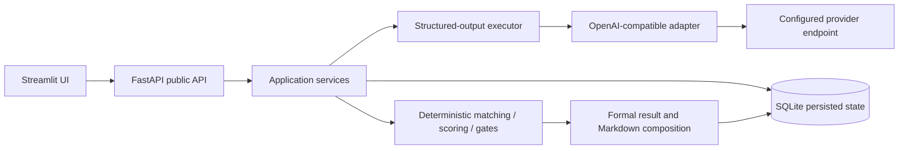
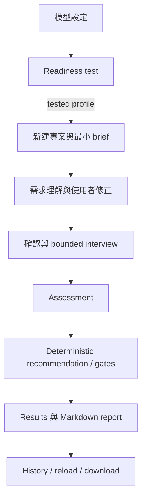

# P8.1a Portfolio baseline

本文件是 AI PoC Planner 的作品集與技術面試入口。它描述目前已完成的產品基線、可重現的 Demo 路徑、治理邊界與尚未完成的工作；不宣稱完整 P7.2 或 production-ready。

## 一分鐘定位

AI PoC Planner 協助企業把模糊的 AI 導入構想整理成可確認的需求、可比較的 PoC 方案與受治理約束的規劃報告。

它適合業務負責人、PoC／轉型負責人、技術面試官與需要檢視 AI 治理邊界的工程團隊。產品重點不是讓模型替人做決策，而是把模型放在有限且可驗證的位置：

- LLM 理解模糊需求、提出訪談問題、整理 confirmed facts，並產生受 schema 約束的候選方案與敘事。
- Deterministic code 負責 matching、reviewed-case matching、recommendation category、六維評分、hard gates、正式 authority／boundary 與持久化一致性。
- Provider 輸出不能直接改變正式推薦、分數、權重、gate disposition、catalog 事實或權限動作。

## 系統架構



關鍵邊界：Streamlit 只能透過 FastAPI 取得產品資料；provider adapter 是唯一真實模型傳輸邊界；executor 只處理結構化輸出；正式決策由 application 的 deterministic policy 產生；SQLite 保存可重新進入的結果，但不保存 prompt、reasoning、raw provider response、Authorization 或 API key。

## 使用者 workflow



未通過 readiness 的 profile 不可進入正式分析；沒有 provider 時流程會停止，不會切換 fake provider 或其他模型。

## 五分鐘 Demo runbook

### 1. 建立環境

```powershell
py -3.12 -m venv .venv
.\.venv\Scripts\python.exe -m pip install -e ".[dev]"
```

專案不會自動安裝或下載模型、provider、llama.cpp、Ollama 或其他 runtime。

### 2. 啟動 UAT runtime

```powershell
.\scripts\start-local.ps1 -Mode Uat
.\scripts\status-local.ps1 -Mode Uat
```

Streamlit 使用 `18501-18599`，FastAPI 使用 `18610-18699`。停止時執行：

```powershell
.\scripts\stop-local.ps1 -Mode Uat
```

### 3. 建立 model profile

在「模型設定」輸入 OpenAI-compatible endpoint、模型名稱與明確 capability，保存後執行 readiness test。API key 可為空（依 profile authentication capability），但不應出現在截圖、報告或錯誤訊息中。

### 4. 執行 synthetic governed_access Demo

使用既有 [`scenarios.json`](../../tests/fixtures/product_acceptance/scenarios.json) 的 `governed_access` fixture。它是作品集用的合成測試資料，不是真實公司員工或權限資料。

依序展示：

1. 新建專案與最小需求 brief。
2. 檢視 AI requirement understanding，提交一次 correction，再確認需求。
3. 完成 bounded interview，保留 unknown／missing facts 的可見狀態。
4. 執行 Assessment，檢視 reviewed cases、recommendation category、scores 與 hard gates。
5. 開啟 Results，下載 Markdown report。
6. 從 History 重新進入同一版本，確認 reload／download 不重新呼叫 provider。

代表情境的正式預期包括：`rules_first`、主管保留最終核准、AI 不直接寫入權限、未核准外部端點不處理個資，以及 deterministic gate 結果不因 provider 改變。

## P7.2a compatibility evidence

P7.2a 已完成一次代表性雙端點 checkpoint：

- `governed_access` 完成 NVIDIA 與本機 llama.cpp 的 readiness、discovery、analysis、report。
- 兩端使用同一個 OpenAI-compatible adapter 與 JSON Schema structured output，`fallback_used=false`。
- normalized deterministic result 一致：`matching_status=matched`、`recommendation_category=rules_first`、`decision_authority=human_final_decision`、`processing_boundary=private_endpoint`。
- reviewed cases 為非空且不重複；duplicate、history、reload、Markdown download、restart 與 secret-safety checks 通過。

這是代表情境證據，不是所有模型、runtime 或 golden scenarios 的相容性保證。完整四情境矩陣仍屬 P7.2b。

## 安全與持久化邊界

- model profile 以 project-bound snapshot 綁定；未啟用或未測試 profile 會 fail closed。
- API key 不出現在 public profile response、UI error、SQLite 正式資料或 Markdown。
- Authorization header、raw provider body、prompt、reasoning trace 與內部路徑不落庫。
- reload、history、refresh、download、duplicate POST 與 restart 讀取已保存結果，不重新呼叫 provider。
- `governed_access` 僅允許 assistive workflow；主管保留最終核准，AI 不直接執行權限寫入。

## 截圖清單

作品集截圖應使用 synthetic fixture，並移除 endpoint、API key、UUID、SQLite 路徑與 provider output。

- [ ] 首頁：產品定位、模型狀態、最近專案。
- [ ] 模型設定：capability、readiness test、清除 API key 選項。
- [ ] 新建專案：model profile 綁定與最小 brief。
- [ ] 需求理解：AI understanding、correction、confirmation。
- [ ] Interview：問題、為什麼重要、unknown／missing fact 狀態。
- [ ] Assessment：方案比較、reviewed cases、recommendation、hard gates。
- [ ] Results：executive narrative、正式結果、Markdown download。
- [ ] History：re-entry、reload 後不重新呼叫 provider 的說明。

## 技術亮點與可面試說明

- 用 capability contract 將 authentication、token、reasoning 與 structured-output policy 從 provider 名稱中分離。
- 用 shared executor 統一 JSON Schema、JSON Object、Pydantic validation、bounded repair 與安全錯誤。
- 把 LLM 的敘事輸出與 deterministic formal result 分開，避免模型直接決定 recommendation 或 gate。
- 以 SQLite immutable version、persisted report 與 no-rerun checks 支援可追溯的 history/reload。
- 以 opt-in live UAT 與 synthetic fixture 分離真實 provider 證據和可重現的離線測試。

## Limitations 與下一步

- P7.2b 四個 golden scenarios 的完整雙端點 compatibility matrix 尚未完成。
- P7.2 overall 仍為 incomplete；P7.2a 不等於完整 P7.2。
- 尚未提供 consumer installer、雲端部署、帳號、多租戶、PDF／DOCX export 或 provider/model 自動安裝。
- production-grade credential encryption 仍是 deferred scope。
- 下一步是 P8.1b product-owner and release acceptance，以及獨立評估是否啟動 P7.2b。

## P8.1a acceptance boundary

本文件與 README 完成 portfolio baseline；P8.1b 才負責 product-owner wording、blocked-no-provider、完整 release acceptance 與 UI polish。P8.1a 不修改 application behavior、不新增 provider、不改 deterministic logic、不新增 migration，也不宣告 P7.2 overall 完成。
